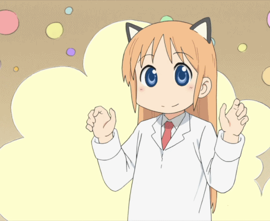

# C# port of [OpenFace](https://github.com/TadasBaltrusaitis/OpenFace)
By 이희준, 김진관, マティアス コンスタンス

Modified version of OpenFace with C# port.
The modified version can be found in Native.

**Credit goes to the creators of OpenFace.**

## Modifications
- Added DLL and SWIG support
- Reorganized source files

## Platforms:
- Windows **x86**, **x64**
- Android **x86**, **x64**, **arm**, **arm64**

# Original README:
## OpenFace: an open source facial behavior analysis toolkit

Over the past few years, there has been an increased interest in automatic facial behavior analysis and understanding. We present OpenFace – an open source tool intended for computer vision and machine learning researchers, affective computing community and people interested in building interactive applications based on facial behavior analysis. OpenFace is the first open source tool capable of facial landmark detection, head pose estimation, facial action unit recognition, and eye-gaze estimation. The computer vision algorithms which represent the core of OpenFace demonstrate state-of-the-art results in all of the above mentioned tasks. Furthermore, our tool is capable of real-time performance and is able to run from a simple webcam without any specialist hardware.

The code was written mainly by Tadas Baltrusaitis during his time at the Language Technologies Institute at the Carnegie Mellon University; Computer Laboratory, University of Cambridge; and Institute for Creative Technologies, University of Southern California.

Special thanks goes to Louis-Philippe Morency and his MultiComp Lab at Institute for Creative Technologies for help in writing and testing the code, and Erroll Wood for the gaze estimation work.

## WIKI
**For instructions of how to install/compile/use the project please see [WIKI](https://github.com/TadasBaltrusaitis/OpenFace/wiki)**

More details about the project - http://www.cl.cam.ac.uk/research/rainbow/projects/openface/

## Functionality

The system is capable of performing a number of facial analysis tasks:

- Facial Landmark Detection

- Facial Landmark and head pose tracking (links to YouTube videos)

- Facial Action Unit Recognition

- Gaze tracking (image of it in action)

- Facial Feature Extraction (aligned faces and HOG features)

## Citation

If you use any of the resources provided on this page in any of your publications we ask you to cite the following work and the work for a relevant submodule you used.

#### Overall system

**OpenFace: an open source facial behavior analysis toolkit**
Tadas Baltrušaitis, Peter Robinson, and Louis-Philippe Morency,
in *IEEE Winter Conference on Applications of Computer Vision*, 2016  

#### Facial landmark detection and tracking

**Constrained Local Neural Fields for robust facial landmark detection in the wild**
Tadas Baltrušaitis, Peter Robinson, and Louis-Philippe Morency. 
in IEEE Int. *Conference on Computer Vision Workshops, 300 Faces in-the-Wild Challenge*, 2013.  

#### Eye gaze tracking

**Rendering of Eyes for Eye-Shape Registration and Gaze Estimation**
Erroll Wood, Tadas Baltrušaitis, Xucong Zhang, Yusuke Sugano, Peter Robinson, and Andreas Bulling 
in *IEEE International. Conference on Computer Vision (ICCV)*,  2015 

#### Facial Action Unit detection

**Cross-dataset learning and person-specific normalisation for automatic Action Unit detection**
Tadas Baltrušaitis, Marwa Mahmoud, and Peter Robinson 
in *Facial Expression Recognition and Analysis Challenge*, 
*IEEE International Conference on Automatic Face and Gesture Recognition*, 2015 

# Copyright

Copyright can be found in the Copyright.txt

You have to respect boost, TBB, dlib, and OpenCV licenses.

# Commercial license

For inquiries about the commercial licensing of the OpenFace toolkit please contact innovation@cmu.edu

# Final remarks

I did my best to make sure that the code runs out of the box but there are always issues and I would be grateful for your understanding that this is research code and not full fledged product. However, if you encounter any problems/bugs/issues please contact me on github or by emailing me at Tadas.Baltrusaitis@cl.cam.ac.uk for any bug reports/questions/suggestions. 

	
